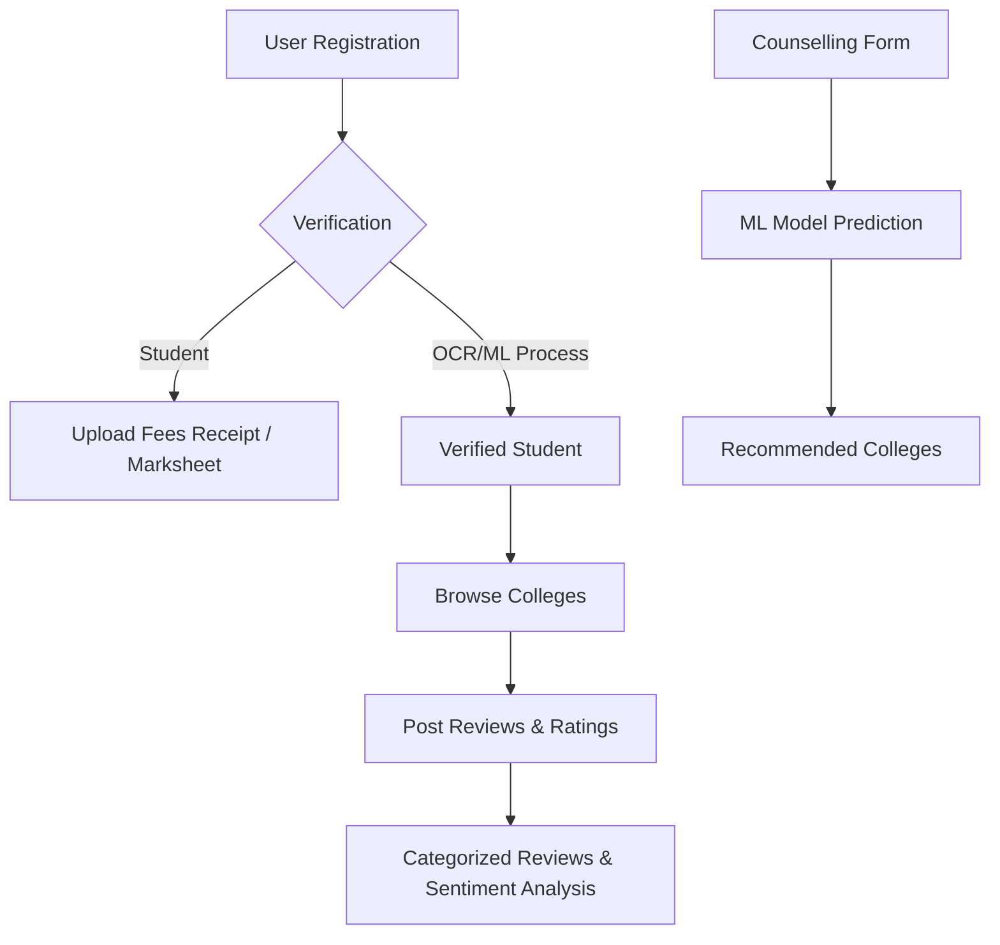

# Database Documentation - College Lens

This document outlines the database structure, table relationships, and data flow for the College Lens application.

## Database Overview
The application uses **SQLite** (stored in `backend/sqlite_data/db.sqlite3`) for development. The database stores information about users, college profiles, reviews, and counselling requests.

---

## 1. Data Flow

1.  **Authentication**: Users register as either a `Student` or `College Admin`.
2.  **Student Verification**: Students must upload documents (receipts/marksheets). The backend uses OCR (EasyOCR/PyMuPDF) and ML to verify if the student actually belongs to the claimed college.
3.  **Review System**: Only verified students can post reviews. Reviews are categorized (Infrastructure, Teaching, etc.) and include sentiment analysis.
4.  **Counselling**: Users can input their scores (JEE, HSC, etc.), and the system predicts suitable colleges using a Random Forest model.

---

## 2. Table List & Details

### App: `users`
This app manages authentication and user-specific profiles.

| Table Name | Purpose | Key Fields |
| :--- | :--- | :--- |
| **`User`** | Custom User model extending `AbstractUser`. | `username`, `email`, `role` (student/college_admin) |
| **`StudentProfile`** | Stores student-specific verification data and documents. | `user` (FK), `college` (FK), `fees_receipt`, `marksheet_first_year`, `verification_status` |
| **`CollegeAdminProfile`**| Links an admin user to a specific college. | `user` (FK), `college` (FK) |
| **`CounsellingRequest`** | Stores user inputs for college predictions. | `jee_mains_rank`, `ssc_percentage`, `hsc_percentage`, `state` |

---

### App: `colleges`
This app manages the core college data and infrastructure details.

| Table Name | Purpose | Key Fields |
| :--- | :--- | :--- |
| **`College`** | The main entity for educational institutions. | `name`, `location`, `average_package`, `highest_package`, `image` |
| **`Course`** | Courses offered by each college. | `college` (FK), `name`, `degree_type`, `fee`, `duration` |
| **`Facility`** | Amenities available (Hostel, Gym, etc.). | `college` (FK), `name`, `icon` |
| **`GalleryMedia`** | Photos and videos of the campus. | `college` (FK), `category` (Library/Campus/etc), `file` |
| **`Cutoff`** | Historic entrance exam cutoff data. | `college` (FK), `course`, `year`, `caste`, `score` |

---

### App: `reviews`
This app handles user feedback and social interactions.

| Table Name | Purpose | Key Fields |
| :--- | :--- | :--- |
| **`Review`** | Categorized ratings and testimonials. | `user` (FK), `college` (FK), `rating`, `category`, `text`, `is_anonymous` |
| **`ReviewImage`** | Images attached to a specific review. | `review` (FK), `image` |
| **`Comment`** | Discussion threads on specific reviews. | `user` (FK), `review` (FK), `text` |

---

## 3. Storage & Media
*   **Media Files**: Images (college banners, review photos) and documents (receipts) are stored in the `backend/media/` directory.
*   **Database Engine**: `django.db.backends.sqlite3`
*   **File Paths**:
    *   `receipts/`: Student fee receipts for verification.
    *   `marksheets/`: Student marksheets.
    *   `college_images/`: Main college profile pictures.
    *   `gallery/`: Campus tour photos/videos.

---

## 4. Key Relationships
*   **One-to-One**: `User` <-> `StudentProfile` / `CollegeAdminProfile`.
*   **One-to-Many**: 
    *   `College` -> `Courses` / `Facilities` / `GalleryMedia` / `Cutoffs`.
    *   `College` -> `Reviews`.
    *   `Review` -> `ReviewImages` / `Comments`.
*   **Many-to-One**: `Review` -> `User` (The student who wrote it).
